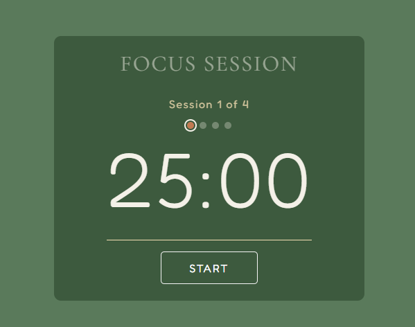

# Pomodoro App Project
I decided to make this project because i love to use pomodoro, and i remember i could make it haha just one at the time. for now i have the first version of the pomodoro, it don't have a lot of features but working!

v1.0
* 25 minutes Pomodoro.
* 5 minutes rest.
* 4 session each (100minutes-pomodoro)-(20minutes-break).
* simple background music during pomodoro and rest.
* 3 buttons (START) (PAUSE) (RESTART)

# Picture
